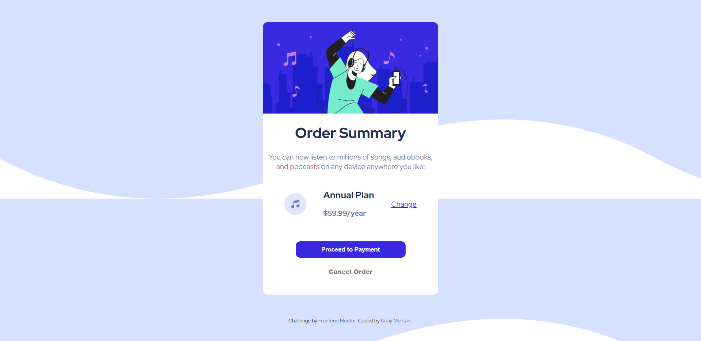

# Order summary card

### Links

- [Solution](https://github.com/uday03meh/order-summary-main-component)
- [Live Site](https://uday03meh-order-summary-card.netlify.app/)

### Built with

- Semantic HTML5 markup
- CSS custom properties
- Flexbox

### What I learned

- inheritance in CSS
- Responsive Web Design
- Active States in CSS

## Author

<!-- - Website - [Add your name here](https://www.your-site.com) -->
- Frontend Mentor - [@uday03meh](https://www.frontendmentor.io/profile/uday03meh)
- Twitter - [@uday03meh](https://www.twitter.com/uday03meh)

